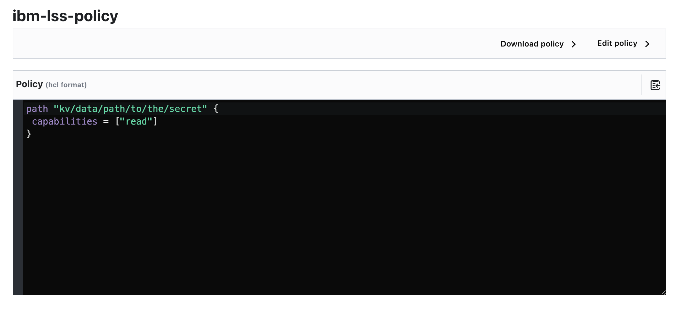

# Hashicorp Vault

Scanner can be integrated with HashiCorp Vault, from which it can get data for container registry authentication.

## Installation of Vault on IKS 

### 1. Create namespace for vault
  ```sh
    kubectl create namespace vault
    kubectl config set-context $(kubectl config current-context) --namespace vault
  ```
### 2. Create PersistentVolume and PersistentVolumeClain for backend data storage 
```yaml
apiVersion: v1
kind: PersistentVolume
metadata:
  name: vault-pv
  labels:
    app: vault
    type: local
spec:
  volumeMode: Filesystem
  capacity:
    storage: 1Gi
  accessModes:
    - ReadWriteMany
  persistentVolumeReclaimPolicy: Delete
  hostPath:
    path: /mnt/vault-storage/
  storageClassName: manual
---
kind: PersistentVolumeClaim
apiVersion: v1
metadata:
  name: vault-pvc
  namespace: vault
  labels:
    app: vault
spec:
  volumeMode: Filesystem
  resources:
    requests:
      storage: 1Gi
  accessModes:
    - ReadWriteMany
  selector:
    matchLabels:
      app: vault
      type: local
  storageClassName: manual
```
Command `kubectl get pvc/vault-pvc -o jsonpath='{.status.phase}'` should show **Bound**

### If you are installing Vault on cluster separate from Scanner apply YAML below:
```YAML
kind: Ingress
apiVersion: networking.k8s.io/v1
metadata:
  name: vault-ingress
  namespace: vault
  annotations:
  annotations:
    nginx.ingress.kubernetes.io/backend-protocol: HTTPS
    nginx.ingress.kubernetes.io/rewrite-target: /$2
spec:
  ingressClassName: public-iks-k8s-nginx
  tls:
    - hosts:
        - <ibm provided ingress subdomain adress>
      secretName: vault-ca-cert
  rules:
    - host: <ibm provided ingress subdomain adress>
      http:
        paths:
          - path: /vault(/|$)(.*)
            pathType: Prefix
            backend:
              service:
                name: vault
                port:
                  number: 443
```

### 3. Now we create ConfigMap with some basic data for our VaultServer

#### Version a. HTTP version (apply when you are not willing to use SSL/HTTPS):
```YAML
apiVersion: v1
kind: ConfigMap
metadata:
  name: vault-cm
  namespace: vault
  labels:
    app: vault
data:
  vault.addr: "http://0.0.0.0:8200"
  local.config: |
    {
    "ui": true,
    "listener": [{
        "tcp": {
        "address": "0.0.0.0:8200",
        "tls_disable": true
        }
    }],
    "storage": [{
        "file": {
        "path": "/vault/backend-file-storage"
        }
    }]
    }
```
#### Version b. HTTPS version (we need to configure Cert Manager):
    
    kubectl apply -f https://github.com/cert-manager/cert-manager/releases/download/v1.14.4/cert-manager.yaml

```YAML
apiVersion: cert-manager.io/v1
kind: Issuer
metadata:
  name: vault-selfsigned-issuer
spec:
  selfSigned: {}
---
apiVersion: cert-manager.io/v1
kind: Certificate
metadata:
  name: vault-ca-cert
spec:
  dnsNames:
    - vault.vault.svc.cluster.local
    - vault.vault.svc
    - '0.0.0.0:8200'
    - '127.0.0.1:8200'
    - <here add ibm provided ingress subdomain adress>
    - <here add Ingress external IP >
  issuerRef:
    kind: Issuer
    name: vault-selfsigned-issuer
  commonName: VaultCA
  isCA: true
  secretName: vault-ca-cert
---
apiVersion: v1
kind: ConfigMap
metadata:
  name: vault-cm
  namespace: vault
  labels:
    app: vault
data:
  vault.addr: "https://<IBM_PROVIDED_SUBDOMAIN_ADDRESS>/vault"
  local.config: |
    {
    "ui": true,
    "listener": [{
        "tcp": {
        "address": "0.0.0.0:8200",
        "tls_disable": false,
        "tls_cert_file" : "/vault/tls/tls.crt", 
        "tls_key_file" : "/vault/tls/tls.key"
        }
    }],
    "storage": [{
        "file": {
        "path": "/vault/backend-file-storage"
        }
    }]
    }
```

Note: Sometimes Ingress may not see the tls-certificate we provided (the vault-ca-cert one). If this happens, just delete Ingress and apply Ingress YAML again.

### 1. Now we apply StatefulSet with out Vault image:
   
 ```YAML
apiVersion: apps/v1
kind: StatefulSet
metadata:
  name: vault-ss
  labels:
    app: vault
    role: server
spec:
  serviceName: vault
  replicas: 1
  selector:
    matchLabels:
      app: vault
      role: server
  template:
    metadata:
      labels:
        app: vault
        role: server
    spec:
      initContainers:
      - name: vault-dir-chmod
        image: alpine:latest
        command: ["/bin/sh", "-c"]
        args:
          - "chmod o+w /vault/backend-file-storage"
        volumeMounts:
        - name: vault-backend-file-storage
          mountPath: /vault/backend-file-storage
      containers:
      - name: vault
        image: vault:1.13.3
        imagePullPolicy: IfNotPresent
        securityContext:
          capabilities:
            add: [ "IPC_LOCK" ]
        args:
          - "server"
        env:
        - name: VAULT_ADDR
          valueFrom:
            configMapKeyRef:
              name: vault-cm
              key: vault.addr
        - name: VAULT_LOCAL_CONFIG
          valueFrom:
            configMapKeyRef:
              name: vault-cm
              key: local.config
        livenessProbe:
          exec:
            command:
            - pidof
            - vault
          initialDelaySeconds: 5
          timeoutSeconds: 2
        ports:
        - containerPort: 8200
          name: api
        - containerPort: 8201
          name: rpc
        volumeMounts:
        - mountPath: /vault/backend-file-storage
          name: vault-backend-file-storage
        - mountPath: /vault/tls
          name: vault-tls-data
      volumes:
      - name: vault-backend-file-storage
        persistentVolumeClaim:
          claimName: vault-pvc 
      - name: vault-tls-data
        secret:
          secretName: vault-ca-cert
```
### 6. Now we create Service for our Vault and VaultUI
```YAML
apiVersion: v1
kind: Service
metadata:
  name: vault-ui
  namespace: vault
spec:
  type: LoadBalancer
  ports:
  - port: 8200
    protocol: TCP
  selector:
    app: vault
    role: server
---
apiVersion: v1
kind: Service
metadata:
  name: vault
spec:
  ports:
  - name: api
    port: 443
    targetPort: 8200
  - name: rpc
    port: 8201
  selector:
    app: vault
    role: server
```

And that's all! Our Vault should be up and running! :) 


## Configuration of Vault to work with Kubernetes

First we have to initialize and unseal our Vault. We can execute vault API commands from Kubernetes Dashboard directly on pod, or by `kubectl exec`. If we are using HTTP version, we don't need to use `-ca-cert=(...)` option. This is our certificate to use HTTPS protocol. 

### 1. Initialize Vault:
   ```
   kubectl exec -it vault-ss-0 -c vault -- /bin/sh -c 'vault operator init -ca-cert="/vault/tls/ca.crt"'
   ```

We should get list of 5 unseal keys and 1 initial root token.

### 2. Unseal Vault:
    
    By default Vault is sealed, which means we can't read or write data from it. To use Vault we must Unseal it by command 
```
kubectl exec -it vault-ss-0 -c vault -- /bin/sh -c 'vault operator unseal -ca-cert="/vault/tls/ca.crt" <unseal_key>'
``` 
We have to call this command 3 times with 3 different unseal keys.

### 3. Log in  to Vault as root
```
kubectl exec -it vault-ss-0 -c vault -- /bin/sh -c 'vault login -ca-cert="/vault/tls/ca.crt"'
```
And enter root key you get on initialization.

### 4. Enable K8s Auth methon in Vault

```
kubectl exec -it vault-ss-0 -c vault -- /bin/sh -c 'vault auth enable -ca-cert="/vault/tls/ca.crt" kubernetes'
```

### 5. Create Token_Reviewer on you Cluster with Scanner, so Vault can confirm that provided Request comes from LS Scanner.

```YAML
apiVersion: v1
kind: ServiceAccount
metadata:
  name: jwt-token-reviewer 
  namespace: default
---
apiVersion: rbac.authorization.k8s.io/v1
kind: ClusterRoleBinding
metadata:
  name: role-tokenreview-binding
  namespace: default
roleRef:
  apiGroup: rbac.authorization.k8s.io
  kind: ClusterRole
  name: system:auth-delegator
subjects:
  - kind: ServiceAccount
    name: jwt-token-reviewer
    namespace: default
---
apiVersion: v1
kind: Secret
metadata:
  name: vault-k8s-auth-secret
  namespace: default
  annotations:
    kubernetes.io/service-account.name: jwt-token-reviewer
type: kubernetes.io/service-account-token
```
### 6. Now export data for Vault Configuration...
#### Export commands below while being logged with kubectl to SCANNER Cluster!
```bash
REVIEWER_JWT=$(kubectl get secret vault-k8s-auth-secret -n default -o jsonpath='{.data.token}' | base64 --decode)
CA_CERT=$(kubectl get cm kube-root-ca.crt -n default -o jsonpath='{.data.ca\.crt}')   
```
#### Rember that Kubernetes CA_CERT must be from the cluster, that License Service Scanner is installed.

... and check Kubernetes host address with `kubectl cluster-info` (usually the shortest one).

### 7. We can configure K8s Auth method with our Cluster API
#### Execute this commands while being logged on Vault cluster!
   ```
 kubectl exec -it vault-ss-0 -c vault -- /bin/sh -c \
 "vault write -ca-cert='/vault/tls/ca.crt' auth/kubernetes/config \
 token_reviewer_jwt=$REVIEWER_JWT \
 kubernetes_host=$KUBERNETES_HOST \
 kubernetes_ca_cert=\"$CA_CERT\""
   ```

Now Vault can communicate with our cluster and can validate ServiceAccounts.

## Configuring Vault Access

Vault rely on path access, which means, specific roles can have access to specific files in its filesystem. Now we create role, which has access to secret and can be accessed via ServiceAccount JWT.

### 1. Let's create KV Secret Engine and some secret via UI (check Vault Documentation).


### 2. Create Policy with access to this secret. For example:


(Policies -> Create ACL policy)

### 3. Create role, which will use this policy:
```
kubectl exec -it vault-ss-0 -c vault -- /bin/sh -c \
"vault write -ca-cert='/vault/tls/ca.crt' auth/kubernetes/role/<scanner> \
    bound_service_account_names=<service-account-with-access> \
    bound_service_account_namespaces=<ibm-licensing-scanner> \
    policies=ibm-lss-policy \
    ttl=1h"
```

### 4. Now we can use command:
`vault login`.
ServiceAccount's JWT have its name and namespace encoded in body, so when we attach this JWT to our Login Request, and specify role, Vault will check if there's role which can be accessed from this ServiceAccount and Namespace and will ask JWT_Reviewer if this token is valid. If so, then it'll grant access and return X-Vault-Token which we use when we make API calls to Vault.
For more details chech HashiCorp Vault documentation.

## How scanner works with 

In our CR we can specify where are credential needed to authorize in container registry:

```YAML
apiVersion: operator.ibm.com/v1
kind: IBMLicenseServiceScanner
metadata:
  labels:
    app.kubernetes.io/name: ibm-licensing-scanner-instance
    app.kubernetes.io/instance: ibm-licensing-scanner-instance
    app.kubernetes.io/part-of: ibm-licensing-scanner-operator
    app.kubernetes.io/managed-by: kustomize
    app.kubernetes.io/created-by: ibm-licensing-scanner-operator
  name: ibm-licensing-scanner-instance
  namespace: ibm-licensing-scanner
spec:
  registries:
    - name: registry-1-icr-with-vault
      host: icr.io                                    
      username: iamapikey                                              
      auth-method: VAULT                                                  
      vault:
        login-url: https://<ibm_provided_subdomain>/vault/v1/auth/kubernetes/login    
        secret-url: https://<ibm_provided_subdomain>/vault/v1/kv/data/path/to/the/secret
        key: tajne                                          
        cert: <ca-cert-secret-name>
        service-account: <service-account-with-access>                       
        role: scanner   
  license-service-upload-secret: "ibm-licensing-scanner-upload-secret"
  registry-pull-secret: "ibm-licensing-scanner-registry-pull-secret"
  log-level: "INFO"
  license:
    accept:
      true
  scan:
    frequency: "*/1 * * * *"
```

`spec.registries[*].auth` property can be `VAULT` only for now. If any of the registry uses IBM API Key, operator creates initContainer for Scanner which logins to Vault, gets Key and creates new `.dockerconfigjson` with credentials to Container Registry.

To make this work we need to prepare our Cluster **before** applying Scanner CR to login to Vault

### 1. We need to create secret, which will contain our ca-cert to connect with Vault API. We can apply YAML below:
```YAML
apiVersion: v1
kind: Secret
metadata:
  name: <ca-cert-secret-name>
  namespace: ibm-licensing-scanner
data:
    ca.crt: ""
type: Opaque
```
Then we can copy ca.crt from Secret we creater for Vault `vault/vault-ca-cert` and paste it into the one we've just created.

### 2. We need to create ServiceAccount which has configured access in Vault:
```yaml
apiVersion: v1
kind: ServiceAccount
metadata:
  name: <service-account-with-access>
  namespace: ibm-licensing-scanner
```

And that's it! Scanner Operator will create token for this Service Account, mount everything in Pod and pass every Value to Scanner. Then it'll check Vault for value and create `.dockerconfigjson`

NOTE: Init container will not be creater if no registry uses VAULT to store data.